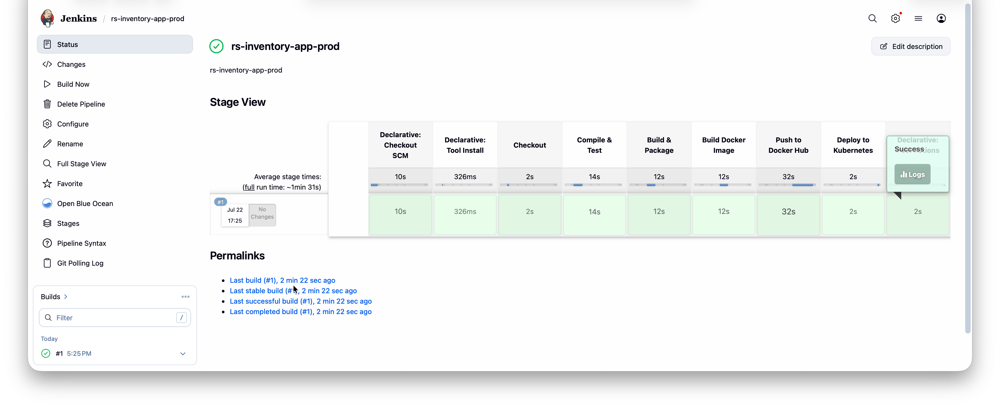
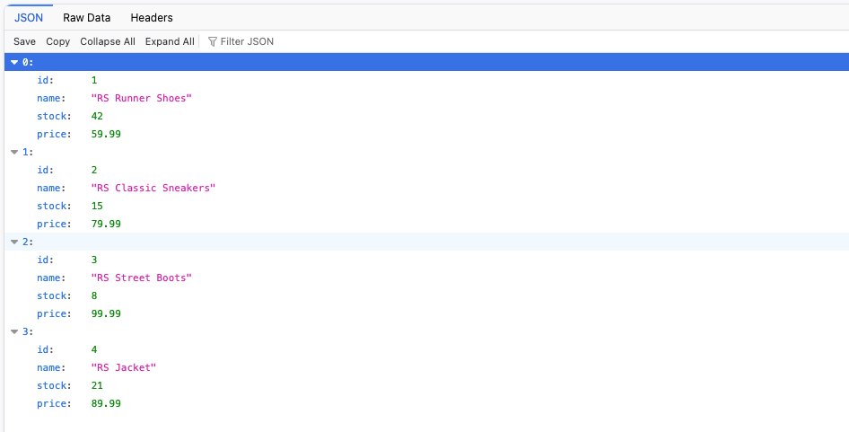
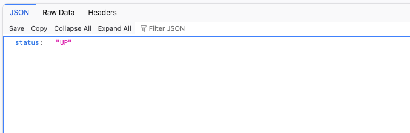
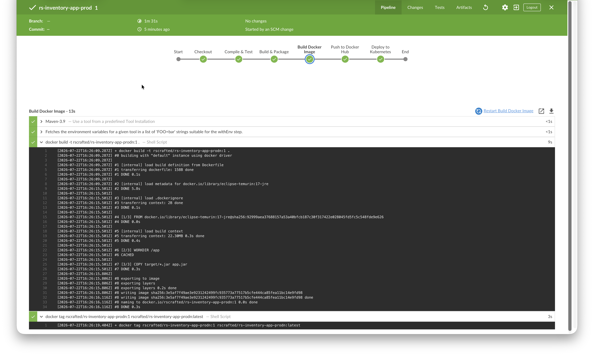
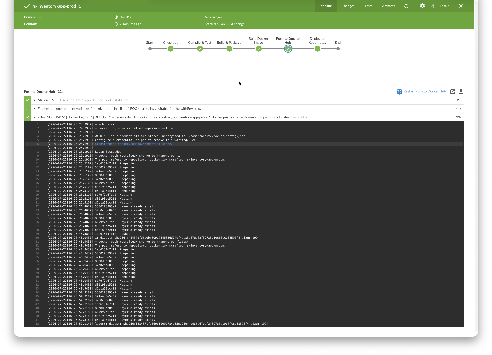
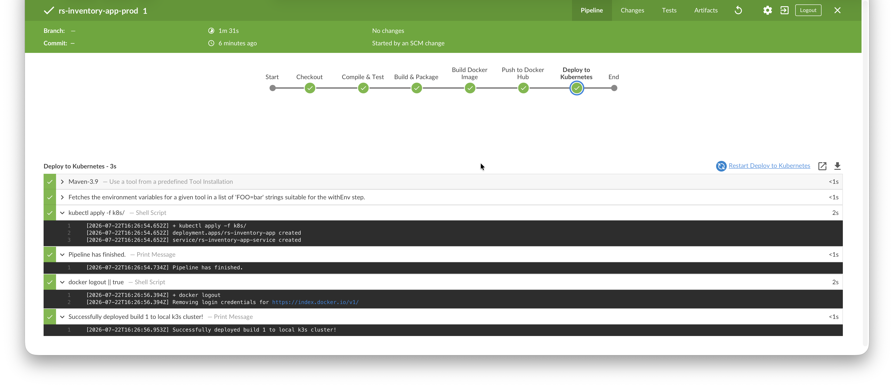
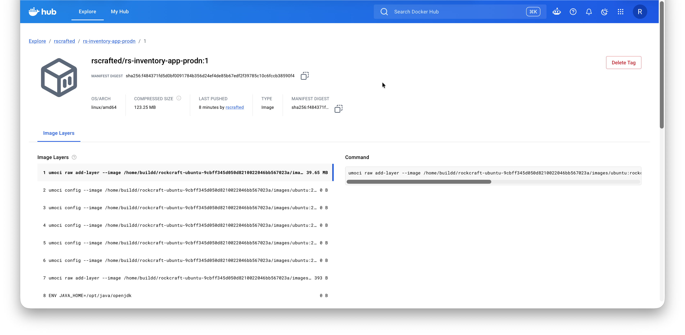
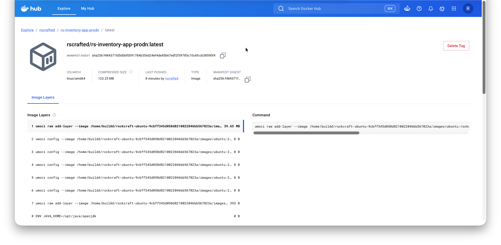
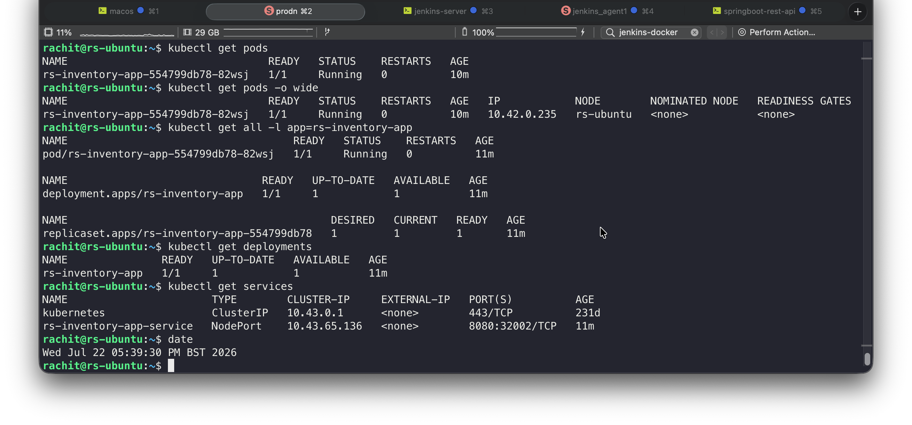
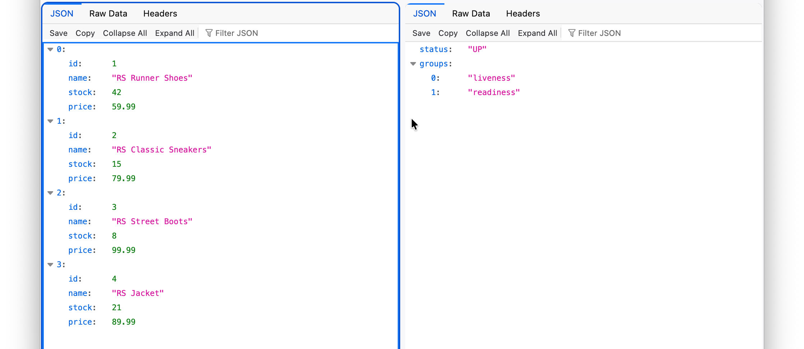

# Jenkins & Kubernetes - End-to-End CI/CD Pipeline

This project demonstrates end-to-end automated CI/CD pipeline for a Spring Boot REST microservice using **Jenkins**, **Docker Hub**, and **Kubernetes**.



## Pipeline Architecture & Flow

```
[ Developer Commit (GitHub)]
         │
         ▼
[ Jenkins Agent (jenkins_agent1) ]
         │
         ├── 1. Compile & Test (mvn clean compile test)
         ├── 2. Build & Package (mvn package -DskipTests)
         ├── 3. Build Docker Image (eclipse-temurin:17-jre)
         ├── 4. Push to Docker Hub (PAT Authentication)
         │
         ▼
[ Kubernetes Cluster (K3s/EKS) ]
         └── 5. Deploy Manifests (kubectl apply -f k8s/)

```

## Project Structure

```plaintext
.
├── Dockerfile                  # Lightweight JRE runtime image definition
├── Jenkinsfile                 # Multi-stage CI/CD pipeline script
├── docker-compose.yml          # Local multi-container orchestration
├── pom.xml                     # Maven dependencies & build definitions
├── cleanup.sh                  # Utility script to teardown K8s resources
├── k8s/
│   ├── deployment.yaml         # Kubernetes Deployment manifest
│   └── service.yaml            # Kubernetes NodePort Service manifest
└── src/                        # Spring Boot application source code
```

## Prerequisites & Setup

* **Jenkins Controller (Server)**
  * Jenkins instance configured with Maven and Credentials plugins.
  * Global Environment Variable: `DOCKER_REGISTRY_USER` configured.
  * Credential ID: `dockerhub-creds` (Username and Docker Hub Personal Access Token).
  * Credential ID: `KUBECONFIG` (Secret File containing cluster configuration).

* **Jenkins Dedicated Agent**
  * Configured label: `jenkins_agent1`.
  * Java 17 & Maven 3.9 configured via Jenkins Global Tools.
  * `kubectl` CLI installed ([Kubernetes Installation Guide](https://kubernetes.io/docs/tasks/tools/install-kubectl-linux/)).
  * Cluster API access configured at `~/.kube/config` (or tracked via gitignored `k8s/kubeconfig`).

* **Kubernetes Cluster**
  * Running K3s or AWS EKS cluster with port `6443` open to the Jenkins agent.

> [!NOTE]
> - If running the Jenkins agent inside a container, interactive `kubectl` commands will not work directly inside the container shell. Because `KUBECONFIG` is injected via a Jenkins Secret File, only the pipeline execution context has access to the cluster configuration. can perform the kubectl execution.
> - Running `kubectl` without a valid cluster config on the agent will result in API authentication/connection errors.

## API Endpoints

- GET /inventory
- GET /actuator/health

| Inventory Output | Health Check Output |
| :---: | :---: |
|  |  |

## Build and run local (Without Docker)

```bash
# 1. Package the application
mvn clean package

# 2. Run the executable JAR
java -jar target/springboot-app.jar

# 3. Cleanup
mvn clean
```

*Access endpoints at:* `http://<server-ip>:8080/inventory` and `http://<server-ip>:8080/actuator/health`

## Docker

> [!IMPORTANT]
> *Access service at:* `http://<server-ip>:2002/inventory`

### Running via Docker

> [!NOTE]
> The `Dockerfile` uses a runtime-only JRE image (`eclipse-temurin:17-jre`) without Maven, so manual compilation is required prior to running locally. Use mvn clean once you have ran `docker compose down`.

```bash
# 1. Package the application
mvn clean package

# 2. Build local image
docker build -t rs-springboot-app:v1.0.0 .

# 3. Run container with named instance
docker run -d -p 2002:8080 --name rs-inventory-app rs-springboot-app:v1.0.0
```

### Docker Compose

```bash
# Start container
docker-compose up -d

# Rebuild and restart if Dockerfile or code changes
docker-compose up -d --build

# Stop and clean up containers
docker-compose down
```

## Key Pipeline Stages

### Docker Build Image



### Docker Hub Registry Push



### Deploy to Kubernetes




### Docker Hub Verification

| Docker Image with Jenkins Build # Ref Tag | Docker Image with Latest Tag |
| :---: | :---: |
|  |  |

## Kubernetes Deployment & Verification

> [!NOTE]
> The application service exposes **NodePort 32002** mapped to target port 8080.

The pipeline automatically deploys all manifests inside `k8s/` using `kubectl apply -f k8s/`.

### Useful Inspection Commands

```bash
# Check all resources for the app
kubectl get all -l app=rs-inventory-app

# Inspect running pods with node IPs
kubectl get pods -o wide

# Check deployments and services
kubectl get deployments
kubectl get services
```





## Troubleshooting & Cleanup

### Cluster Connection Errors (`no route to host` / Port 6443)

Verify route/firewall settings between the agent and control plane, and check cluster service status:

```bash
sudo systemctl status k3s
sudo systemctl daemon-reload
```

### Resource Teardown

A helper script (`cleanup.sh`) is provided to tear down deployed Kubernetes resources:

```bash
chmod +x cleanup.sh
./cleanup.sh
```